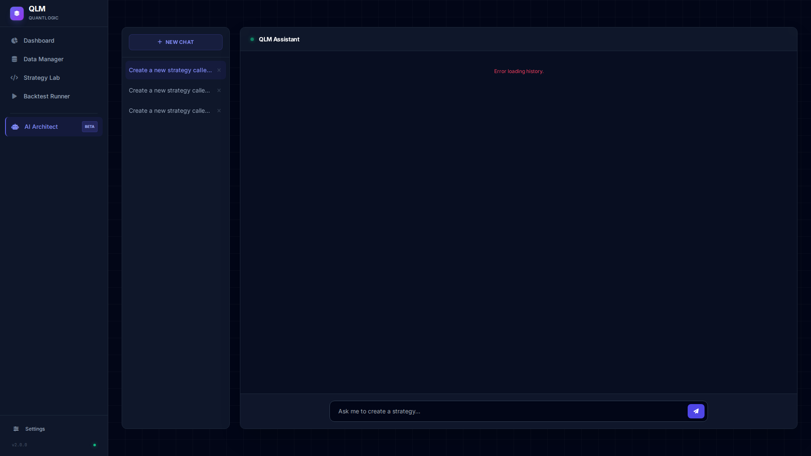
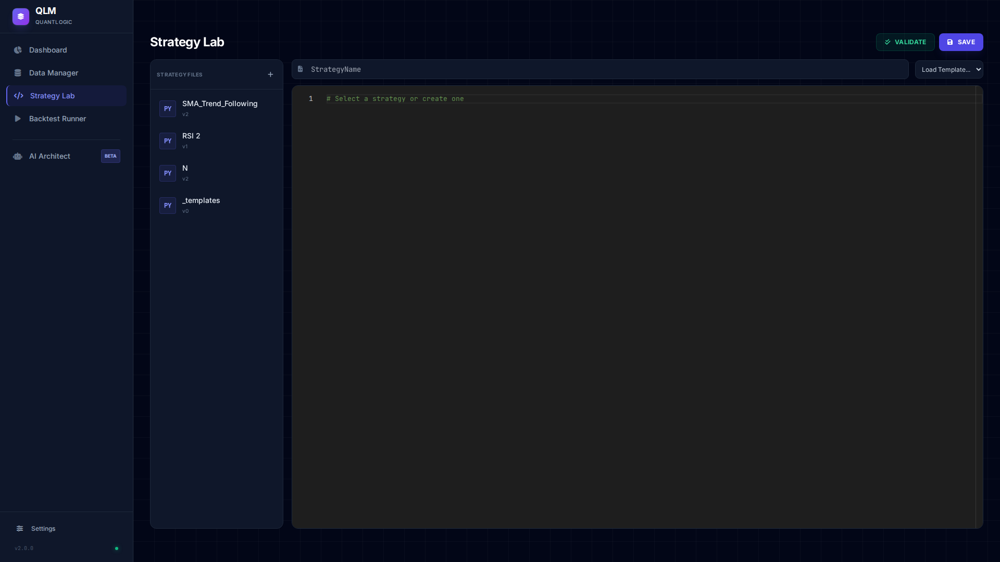
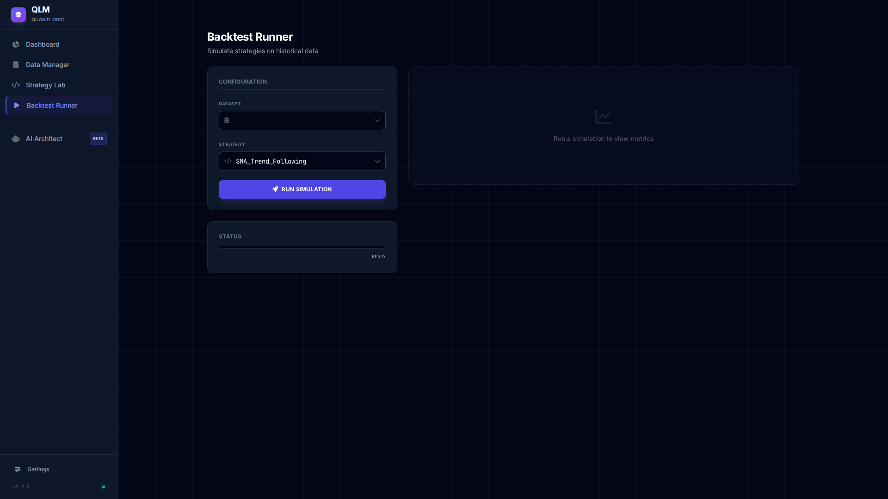
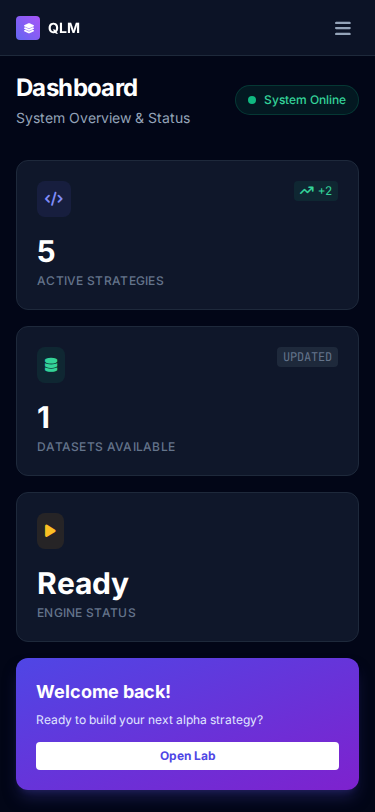

# 🚀 QuantLogic Framework (QLM)


**QuantLogic Framework (QLM)** is an institutional-grade algorithmic trading platform designed for quantitative researchers. It integrates a high-performance **Event-Driven Backtester** with an autonomous **AI Research Agent** capable of self-healing, multi-step reasoning, and full strategy lifecycle management.

---

## 📸 Interface Preview

### Desktop Terminal
| **Dashboard** | **AI Architect** |
|:---:|:---:|
|  |  |

| **Strategy Lab** | **Backtest Runner** |
|:---:|:---:|
|  |  |

### Mobile Responsive


---

## ✨ Key Features

### 🧠 Agentic AI Core
*   **ReAct "Brain" Architecture**: The AI reasons in loops (Thought -> Action -> Observation) to solve complex tasks.
*   **Self-Healing Workflow**: If a tool fails (e.g., syntax error in generated code), the agent analyzes the stack trace and autonomously pushes a fix.
*   **Context & Job Management**: Maintains awareness of long-running goals ("Create a mean reversion strategy for BTC") across multiple chat turns.
*   **Auto-Coder**: Generates high-quality, bug-free Python strategies strictly adhering to the QLM interface.

### 📊 Professional Data Management
*   **Universal Ingestion**:
    *   **Local Upload**: Drag-and-drop CSV uploads.
    *   **Remote Import**: Direct download from URLs (CSV or ZIP). Automatic extraction and validation.
*   **Parquet Storage**: High-performance columnar storage for million-row datasets.
*   **Market Structure Analytics**: Built-in tools for Trend, Volatility (ATR), and Support/Resistance analysis.

### ⚡ Institutional-Grade Backtesting
*   **Event-Driven Engine**: Simulates realistic market conditions candle-by-candle.
*   **Advanced Metrics**: Max Drawdown (Abs), Profit Factor, Sharpe Ratio, Expectancy.
*   **Position Sizing**: Dynamic sizing logic embedded in strategies.
*   **Vectorized & Loop Hybrid**: Optimized for both speed and complex logic.

### 🖥️ "Financial Terminal" UI
*   **Modern Design**: Dark-themed, Slate/Zinc aesthetics using **Tailwind CSS**.
*   **Mobile Responsive**: Fully functional on desktop and mobile devices.
*   **Real-Time Visualization**: WebSocket-powered progress bars and live "Thinking" status updates from the AI.

---

## 🛠️ Installation

### Prerequisites
*   Python 3.12+
*   Git

### Quick Start

1.  **Clone the Repository**
    ```bash
    git clone https://github.com/Praveens1234/QLM.git
    cd QLM
    ```

2.  **Install Dependencies**
    ```bash
    pip install -r requirements.txt
    ```

3.  **Run the Application**
    ```bash
    python -m backend.main
    ```
    Access the terminal at `http://localhost:8000`.

---

## 🚀 Usage Guide

### 1. Ingest Data
Navigate to **Data Manager**.
*   **Local**: Upload OHLCV CSV files.
*   **URL**: Paste a direct link to a CSV or ZIP file (e.g., from Catbox, GitHub raw).
*   **Format**: `Date, Open, High, Low, Close, Volume` (auto-detected).
*   **Processing**: auto-converted to Parquet for speed.

### 2. AI Architect
Go to the **AI Assistant** tab.
*   **Ask**: "Analyze XAUUSD 1H structure and write a Trend Following strategy."
*   **Advanced**: "Download dataset from [URL] for symbol BTCUSD 1H and test it."
*   **Watch**: The "Status Pipeline" will show the agent analyzing data -> planning -> coding.
*   **Auto-Fix**: If the code fails validation, the agent will see the error and fix it automatically.

### 3. Strategy Lab
*   Review and edit the generated Python code.
*   Click **"Validate"** to run a safety check and dry-run simulation.
*   Click **"Save"** to version control your strategy.

### 4. Backtest Runner
*   Select your Dataset and Strategy.
*   Click **"Run Simulation"**.
*   View real-time progress and detailed performance metrics.

---

## 📂 Project Structure

```
QLM/
├── backend/                # FastAPI Application
│   ├── ai/                 # AI Brain, Agent, Tools, Memory, Store
│   ├── core/               # Backtest Engine, Strategy Interface, Data
│   ├── api/                # API Routes & WebSockets
│   └── main.py             # Entry Point
├── frontend/               # UI Assets
│   ├── css/                # Tailwind & Custom Styles
│   ├── js/                 # App Logic
│   └── index.html          # Single Page Application
├── strategies/             # User Strategies (Versioned)
├── data/                   # Data Storage (Parquet/SQLite)
└── requirements.txt        # Dependencies
```

---

## 🤝 Contributing

Contributions are welcome! Please follow these steps:
1.  Fork the repository.
2.  Create a feature branch (`git checkout -b feature/NewFeature`).
3.  Commit your changes.
4.  Push to the branch.
5.  Open a Pull Request.

---

## 📄 License

This project is licensed under the MIT License - see the [LICENSE](LICENSE) file for details.

---

**Developed with ❤️ by Praveen**
