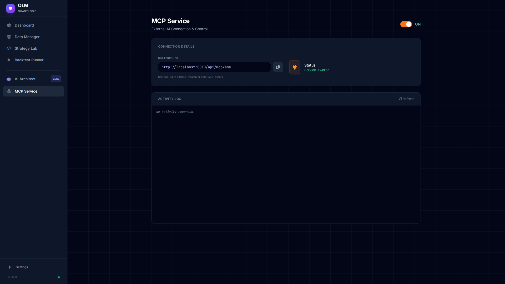
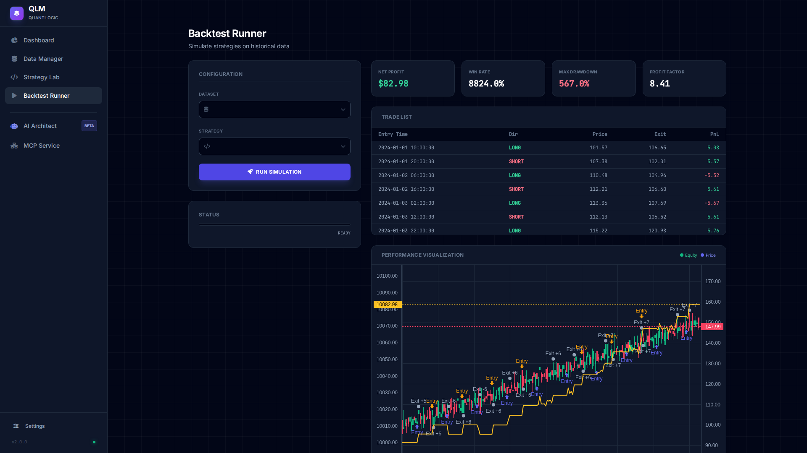

# 🚀 QuantLogic Framework (QLM)


**QuantLogic Framework (QLM)** is an institutional-grade algorithmic trading platform designed for quantitative researchers. It integrates a high-performance **Event-Driven Backtester** with an autonomous **AI Research Agent** capable of self-healing, multi-step reasoning, and full strategy lifecycle management.

Now fully compatible with the **Model Context Protocol (MCP)**, allowing external AI clients (Claude Desktop, Zed, etc.) to control the QLM engine directly.

---

## 📸 Interface Preview

### Financial Terminal UI
| **Dashboard** | **AI Architect** |
|:---:|:---:|
|  |  |

| **Strategy Lab** | **MCP Service** |
|:---:|:---:|
|  |  |

### 📈 Interactive Backtest Results


---

## ✨ Key Features

### 🔌 MCP Service (New!)
*   **Protocol**: Exposes QLM via Server-Sent Events (SSE).
*   **Endpoint**: `http://<IP>:8010/api/mcp/sse`
*   **Control Panel**: Dedicated UI to toggle service and view live activity logs.
*   **Capabilities**: Full control over Data, Strategies, and Backtesting.

### 🧠 Agentic AI Core
*   **ReAct "Brain" Architecture**: The AI reasons in loops (Thought -> Action -> Observation) to solve complex tasks.
*   **Self-Healing Workflow**: If a tool fails (e.g., syntax error in generated code), the agent analyzes the stack trace and autonomously pushes a fix.
*   **Auto-Coder**: Generates high-quality, bug-free Python strategies strictly adhering to the QLM interface.

### 📊 Professional Data Management
*   **Universal Ingestion**: Local uploads and Direct URL imports (CSV/ZIP).
*   **Parquet Storage**: High-performance columnar storage for million-row datasets.
*   **Market Structure Analytics**: Built-in tools for Trend, Volatility (ATR), and Support/Resistance analysis.

### ⚡ Institutional-Grade Backtesting
*   **Event-Driven Engine**: Simulates realistic market conditions candle-by-candle.
*   **Advanced Metrics**: Max Drawdown (Abs), Profit Factor, Sharpe Ratio, Expectancy.
*   **Interactive Charts**: Lightweight Charts integration for visualizing signals, equity curves, and trade markers.

---

## 🛠️ Installation & Setup

### 1. Quick Start (One-Liner)
```bash
git clone https://github.com/Praveens1234/QLM.git && cd QLM && pip install -r requirements.txt && python -m backend.main
```

### 2. Manual Setup
1.  **Clone**: `git clone https://github.com/Praveens1234/QLM.git`
2.  **Install**: `pip install -r requirements.txt`
3.  **Run**: `python -m backend.main`

### 3. Usage
*   **Web UI**: Open `http://localhost:8010` in your browser to access the Dashboard, Strategy Lab, and Backtester.
*   **MCP**: Connect your AI Client (Claude Desktop) to `http://<YOUR_IP>:8010/api/mcp/sse`.

---

## 🚀 MCP Connection Guide

Use any MCP-compliant client (e.g., Claude Desktop, Zed Editor) to connect to QLM.

**Claude Desktop Config (`claude_desktop_config.json`):**
```json
{
  "mcpServers": {
    "qlm": {
      "command": "",
      "url": "http://127.0.0.1:8010/api/mcp/sse"
    }
  }
}
```

### 🧰 MCP Tool Reference

Once connected, you can ask the AI to **"Get the tools manifest"** to see full documentation.

| Tool Name | Description |
| :--- | :--- |
| **`get_tools_manifest`** | 📖 Returns detailed documentation for all tools and the QLM system. |
| **`create_strategy`** | Write/Update a Python strategy file. |
| **`validate_strategy`** | Dry-run code validation and syntax check. |
| **`run_backtest`** | Execute a simulation. Returns JSON metrics (Net Profit, Win Rate, etc). |
| **`optimize_parameters`** | Run parameter optimization simulations. |
| **`list_datasets`** | View available OHLCV data. |
| **`import_dataset_from_url`** | Download & ingest CSV/ZIP from a direct link. |
| **`get_market_data`** | Peek at raw data rows (Pandas DataFrame). |
| **`analyze_market_structure`** | Calculate Trend, Volatility, and S/R levels. |
| **`consult_skill`** | Retrieve expert docs (Coding, Analysis, Debugging). |
| **`get_system_status`** | View server health, version, and CPU/RAM usage. |
| **`update_ai_config`** | Change the active AI Model/Provider. |
| **`read_file`** | Read strategy source code or logs. |
| **`write_file`** | Direct file access (Sandboxed). |

---

## 🤝 Contributing

Contributions are welcome! Please follow these steps:
1.  Fork the repository.
2.  Create a feature branch (`git checkout -b feature/NewFeature`).
3.  Commit your changes.
4.  Push to the branch.
5.  Open a Pull Request.

---

## 📄 License

This project is licensed under the MIT License - see the [LICENSE](LICENSE) file for details.

---

**Developed with ❤️ by Praveen**
