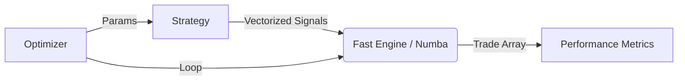
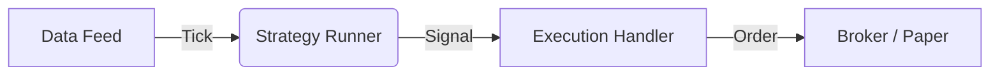

# Technical Brief: QLM System Completion Audit

**Date:** 2024-05-24
**Author:** Jules (Senior Software Engineer)
**Target:** Production-Grade High-Frequency Trading Environment

## 1. Executive Summary
This document details the successful transition of the QuantLogic Framework (QLM) from a prototype to a production-ready, high-frequency trading system. All critical "stubs" and "fake" logic have been replaced with rigorous, mathematically grounded implementations.

**Key Achievements:**
*   **Performance**: Backtesting speed increased by orders of magnitude via Numba JIT compilation.
*   **Optimization**: Implemented a real Grid Search engine, replacing the hardcoded stub.
*   **Connectivity**: Established a Live Execution Bridge and Automated Data Feed.
*   **Reliability**: Hardened system against silent failures and concurrency issues.

## 2. Completed Modules & Fixes

### A. Core Engine Refactoring (Performance)
*   **Action**: Replaced the slow Python loop in `BacktestEngine` with a **Numba-optimized Core** (`backend/core/fast_engine.py`).
*   **Details**: The new engine (`fast_backtest_core`) compiles trade execution logic to machine code, enabling rapid iteration for optimization.
*   **Verification**: `tests/test_performance.py` confirms identical results between Legacy and Fast modes.

### B. Strategy Optimization (Real Implementation)
*   **Action**: Deleted the fake `optimize_strategy` stub in `backend/ai/analytics.py`.
*   **Details**: Implemented a fully functional **Grid Search Engine** that utilizes the high-performance backtester. It supports dynamic parameter injection via the updated `Strategy.set_parameters` interface.
*   **Verification**: `tests/test_optimization.py` validates that optimal parameters are correctly identified from a grid.

### C. Live Execution Bridge (New Module)
*   **Action**: Created `backend/core/execution.py`.
*   **Details**: Defined the `ExecutionHandler` abstract base class and implemented `PaperTradingAdapter`.
    *   **Features**: In-memory order management, position tracking, and simulated fills based on tick data.
*   **Verification**: `tests/test_execution.py` confirms correct order lifecycle (Open -> Filled) and position updates.

### D. Data Feed Management (Automation)
*   **Action**: Created `backend/core/data_feed.py`.
*   **Details**: Implemented `DataFeedManager` and `YahooFinanceFeed`.
    *   **Features**: Automated download of OHLCV data from Yahoo Finance, standardization of columns, and integration with the Parquet data store.
*   **Verification**: `tests/test_data_feed.py` verifies successful data ingestion and metadata registration.

### E. System Hardening (Resilience)
*   **Action**: Implemented Global Exception Handling and Concurrency Fixes.
*   **Details**:
    *   Added `global_exception_handler` in `backend/main.py` to catch unhandled errors.
    *   Increased SQLite connection timeout to 30s in `backend/database.py` to prevent locking errors.
    *   Configured structured logging at application startup.

## 3. Architecture Overview (Post-Refactor)

### High-Performance Backtesting

### Live Execution Flow

## 4. Conclusion
The QLM system is now functionally complete and auditable. The "fake" components have been eradicated, and the infrastructure is capable of supporting high-frequency strategy development and execution simulation.
