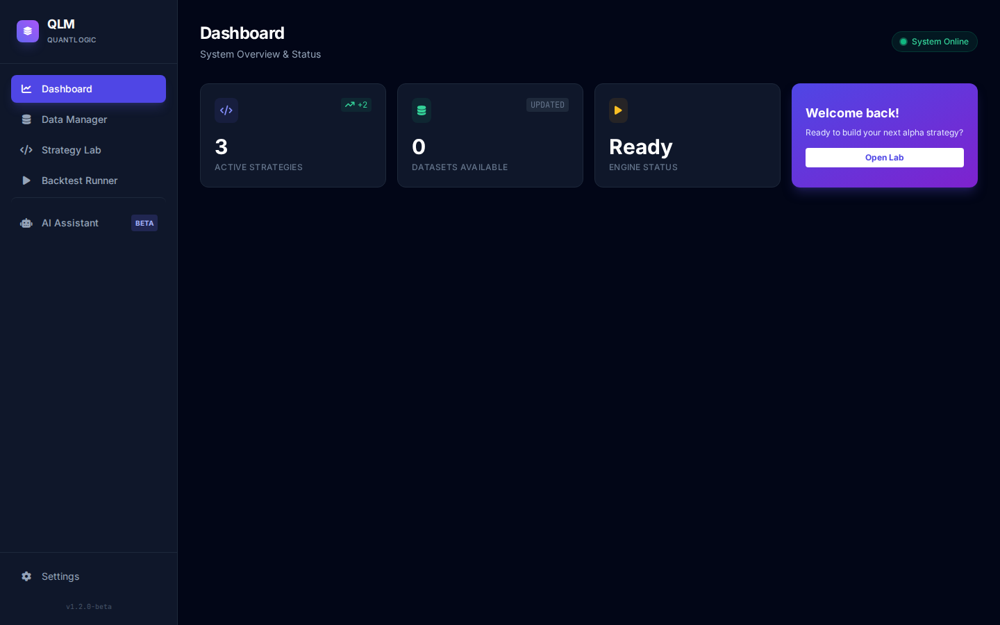

<div align="center">

<!-- Professional Logo/Banner with proper sizing -->
<picture>
  <source media="(prefers-color-scheme: dark)" srcset="https://img.shields.io/badge/QLM-QuantLogic%20Framework-6366f1?style=for-the-badge&logo=chart-line&logoColor=white&labelColor=0f172a">
  
</picture>

<h1 align="center">QuantLogic Framework</h1>

<p align="center">
  <b>Institutional-Grade Algorithmic Trading Platform</b><br/>
  <i>High-Performance Backtesting • MCP-Native AI Integration • Multi-Exchange Live Trading</i>
</p>

<!-- Strategic Badge Layout: Build → Version → Platform → License -->
<p align="center">
  <a href="https://github.com/Praveens1234/QLM/actions">
    
  </a>
  <a href="https://github.com/Praveens1234/QLM/releases">
    
  </a>
  
  
  
  
  <a href="LICENSE">
    
  </a>
</p>

<!-- Navigation Pills -->
<p align="center">
  <a href="#-overview"><kbd>📖 Overview</kbd></a> •
  <a href="#-quick-start"><kbd>🚀 Quick Start</kbd></a> •
  <a href="#-installation"><kbd>⚙️ Installation</kbd></a> •
  <a href="#-mcp-integration"><kbd>🤖 MCP AI</kbd></a> •
  <a href="#-api-reference"><kbd>🔌 API</kbd></a> •
  <a href="#-contributing"><kbd>🤝 Contribute</kbd></a>
</p>

<!-- Hero Screenshot with proper alt text and styling -->
<p align="center">
  
</p>

</div>

---

## 📋 Table of Contents

<!-- Clean, scannable TOC with emojis for visual anchors -->
- [📖 Overview](#-overview)
- [🎯 Why QLM](#-why-qlm)
- [✨ Key Features](#-key-features)
- [🏗️ Architecture](#️-architecture)
- [🛠️ Technology Stack](#️-technology-stack)
- [⚙️ Installation](#️-installation)
- [🚀 Quick Start](#-quick-start)
- [🤖 MCP Integration](#-mcp-integration)
- [📈 Backtest Engine](#-backtest-engine)
- [📊 Performance Metrics](#-performance-metrics)
- [🔌 API Reference](#-api-reference)
- [🧪 Testing](#-testing)
- [🤝 Contributing](#-contributing)
- [📄 License](#-license)
- [🙏 Acknowledgments](#-acknowledgments)

<p align="right">(<a href="#top">back to top</a>)</p>

---

## 📖 Overview

**QuantLogic Framework (QLM)** is a production-grade algorithmic trading platform engineered for quantitative researchers, hedge funds, proprietary trading firms, and systematic traders who demand **institutional-quality infrastructure** with **zero compromises on performance or reliability**.

### The Problem

Building robust algorithmic trading systems requires solving complex technical challenges:

- **Performance Bottlenecks**: Python backtests often run too slowly for meaningful strategy research
- **AI Integration Gap**: Most platforms lack native AI assistant connectivity for rapid development
- **Data Reliability**: Corrupted or inconsistent data silently destroys strategy performance
- **Vendor Lock-in**: Closed-source platforms limit customization and portability
- **Observability Deficits**: Insufficient metrics lead to misunderstood risk and drawdowns

### The Solution

QLM delivers a comprehensive, open-source solution:

```
┌─────────────────────────────────────────────────────────────┐
│  ⚡ NUMBA-ACCELERATED      🤖 MCP-NATIVE      💾 ACID-COMPLIANT  │
│  Backtest Engine           AI Integration     SQLite Storage    │
│                                                             │
│  10-100x faster than       16+ tools for     WAL mode for      │
│  pure Python               Claude/Cursor      crash safety      │
└─────────────────────────────────────────────────────────────┘
```

> [!IMPORTANT]
> QLM is designed for **production deployment**. Every component—from the Numba-compiled execution engine to the SQLite WAL-mode database—is battle-tested for institutional workloads.

<p align="right">(<a href="#top">back to top</a>)</p>

---

## 🎯 Why QLM?

| Challenge | Traditional Solutions | QLM Advantage |
|-----------|----------------------|---------------|
| **Execution Speed** | Pure Python (slow) | **Numba JIT compilation** — 10-100x faster backtests |
| **AI Development** | Manual coding cycles | **MCP-native integration** — AI assistants write & validate strategies |
| **Data Integrity** | CSV files, no transactions | **ACID-compliant SQLite** with WAL mode — crash-proof storage |
| **Exchange Access** | Single-vendor APIs | **CCXT integration** — 100+ exchanges, unified interface |
| **Risk Analysis** | Basic PnL only | **Institutional metrics** — MAE/MFE, R-Multiple, SQN, Monte Carlo |

### Platform Highlights

<div align="center">

| Performance | AI Integration | Risk Management | Exchange Connectivity |
|:-----------:|:--------------:|:---------------:|:---------------------:|
| ⚡ **Numba-Accelerated** | 🤖 **MCP-Native** | 📊 **Institutional Grade** | 🔌 **Multi-Exchange** |
| JIT-compiled execution loops | 16+ tools for AI clients | MAE/MFE, R-Multiple, SQN | CCXT-powered, 100+ markets |

</div>

<p align="right">(<a href="#top">back to top</a>)</p>

---

## ✨ Key Features

### ⚡ High-Performance Backtesting

> [!TIP]
> Use **Fast Mode** (Numba) for production research and optimization. Use **Legacy Mode** (Python) only when debugging complex strategy logic.

| Feature | Implementation | Benefit |
|---------|----------------|---------|
| **Dual Execution Modes** | Fast (Numba JIT) + Legacy (Python) | Speed for research, clarity for debugging |
| **Vectorized Signal Generation** | Pandas-based indicators | Efficient memory usage, clean syntax |
| **Realistic Gap Handling** | SL/TP execution on price gaps | Accurate forex/crypto simulation |
| **Weekend Filtering** | Automatic non-trading day exclusion | Precise equity curve calculation |
| **Parallel Optimization** | ThreadPoolExecutor grid search | Multi-core parameter optimization |

<details>
<summary><b>📊 View Complete Metrics Suite</b></summary>

#### PnL Analytics
- **Net Profit**: Σ(Trade PnL) — Total system profitability
- **Profit Factor**: Gross Profit / Gross Loss — Risk-reward efficiency
- **ROI %**: Return on investment normalized to initial capital
- **Expectancy**: Average expected profit per trade

#### Risk Metrics
- **Maximum Drawdown**: Peak-to-valley equity decline (absolute & percentage)
- **Value at Risk (95%)**: Statistical loss estimate at 95% confidence
- **Sharpe Ratio**: Risk-adjusted return (target: > 1.5)
- **Sortino Ratio**: Downside-deviation adjusted return
- **System Quality Number (SQN)**: Strategy robustness score

#### Trade Analytics
- **R-Multiple**: Profit normalized to initial risk (R-unit accounting)
- **MAE/MFE**: Maximum Adverse/Favorable Excursion — trade trajectory analysis
- **Win Rate & Expectancy**: Probability and profitability metrics
- **Duration Analysis**: Average holding period by strategy type

</details>

### 🤖 MCP-Native AI Integration

QLM implements the **Model Context Protocol (MCP)** as a first-class interface, enabling AI assistants (Claude, Cursor, Windsurf) to directly interact with the trading engine:

```
┌─────────────────────────────────────────────────────────────┐
│                    EXTERNAL AI CLIENTS                      │
│  ┌─────────┐  ┌─────────┐  ┌─────────┐  ┌───────────────┐ │
│  │ Claude  │  │ Cursor  │  │Windsurf │  │ Custom MCP    │ │
│  │ Desktop │  │ IDE     │  │ IDE     │  │ Clients       │ │
│  └────┬────┘  └────┬────┘  └────┬────┘  └───────┬───────┘ │
└───────┼────────────┼────────────┼────────────────┼─────────┘
        │            │            │                │
        └────────────┴────────────┴────────────────┘
                              │
                    SSE Transport (Server-Sent Events)
                              │
                    ┌─────────┴─────────┐
                    │   QLM MCP Server  │
                    │  ┌─────────────┐  │
                    │  │  16+ Tools  │  │
                    │  └─────────────┘  │
                    └─────────┬─────────┘
          ┌───────────────────┼───────────────────┐
          │                   │                   │
    ┌─────┴─────┐       ┌─────┴─────┐       ┌─────┴─────┐
    │   Data    │       │ Backtest  │       │ Strategy  │
    │  Manager  │       │  Engine   │       │  Loader   │
    └───────────┘       └───────────┘       └───────────┘
```

**Available MCP Tools (16 total):**

| Category | Tools | Purpose |
|----------|-------|---------|
| **Data** | `list_datasets`, `import_dataset_from_url`, `get_market_data`, `inspect_dataset_row` | Market data management |
| **Strategy** | `list_strategies`, `get_strategy_code`, `create_strategy`, `validate_strategy`, `get_strategy_coding_guidelines` | Strategy development |
| **Execution** | `run_backtest`, `get_backtest_ledger_url` | Backtest operations |
| **System** | `read_file`, `write_file`, `delete_entity`, `get_system_status`, `get_tools_manifest` | File & system operations |

<p align="right">(<a href="#top">back to top</a>)</p>

---

## 🏗️ Architecture

QLM follows a layered architecture separating concerns for maintainability, testing, and deployment:

```
┌─────────────────────────────────────────────────────────────────┐
│                     PRESENTATION LAYER                          │
│  ┌─────────────────────────────────────────────────────────┐   │
│  │  Vanilla JavaScript + Tailwind CSS                      │   │
│  │  • Monaco Editor (VS Code-grade strategy editing)       │   │
│  │  • Lightweight Charts (financial visualization)         │   │
│  │  • Responsive mobile-first design                       │   │
│  └─────────────────────────────────────────────────────────┘   │
└────────────────────────────┬────────────────────────────────────┘
                             │ HTTP / WebSocket
┌────────────────────────────┴────────────────────────────────────┐
│                      API GATEWAY LAYER                          │
│  ┌─────────────┐  ┌─────────────┐  ┌─────────────────────────┐ │
│  │  REST API   │  │ WebSocket   │  │    MCP Server (SSE)     │ │
│  │  (FastAPI)  │  │  (Real-time)│  │   AI Client Transport   │ │
│  └─────────────┘  └─────────────┘  └─────────────────────────┘ │
└────────────────────────────┬────────────────────────────────────┘
                             │
┌────────────────────────────┴────────────────────────────────────┐
│                       CORE ENGINE LAYER                         │
│  ┌──────────────┐ ┌──────────────┐ ┌──────────────────────────┐│
│  │   Backtest   │ │   Strategy   │ │    Metrics & Analytics   ││
│  │   Engine     │ │    Loader    │ │       Engine             ││
│  │  (Numba JIT) │ │   (Secure)   │ │  (Institutional Grade)   ││
│  └──────────────┘ └──────────────┘ └──────────────────────────┘│
│  ┌──────────────┐ ┌──────────────┐ ┌──────────────────────────┐│
│  │ Data Manager │ │   Execution  │ │    Live Trading (CCXT)   ││
│  │  (SQLite)    │ │   Handler    │ │    Risk Management       ││
│  └──────────────┘ └──────────────┘ └──────────────────────────┘│
└─────────────────────────────────────────────────────────────────┘
```

<p align="right">(<a href="#top">back to top</a>)</p>

---

## 🛠️ Technology Stack

| Layer | Technology | Purpose |
|-------|------------|---------|
| **Backend Framework** | FastAPI 0.109 + Uvicorn | High-performance ASGI API |
| **Compute Engine** | NumPy + Pandas + Numba 0.59 | Vectorized operations + JIT compilation |
| **Database** | SQLite (WAL mode) + PyArrow/Parquet | ACID transactions + columnar storage |
| **AI Protocol** | MCP 1.2 (Model Context Protocol) | Standardized AI assistant integration |
| **Exchange Connectivity** | CCXT 4.2 | Unified 100+ exchange API |
| **Validation** | Pydantic 2.10 | Runtime type safety |
| **Frontend** | Vanilla JS + Tailwind CSS + Monaco Editor | Zero-dependency, professional IDE |
| **Testing** | Pytest 8.0 + Structlog + Tenacity | Comprehensive test coverage & reliability |

<p align="right">(<a href="#top">back to top</a>)</p>

---

## ⚙️ Installation

### Prerequisites

- **Python**: >= 3.10 (3.11 recommended for optimal Numba performance)
- **pip**: Latest version
- **Git**: For cloning and updates

> [!NOTE]
> QLM is tested on Linux (Ubuntu 22.04+), macOS (13+), and Windows 11. WSL2 recommended for Windows users.

### Quick Install (5 minutes)

```bash
# 1. Clone repository
git clone https://github.com/Praveens1234/QLM.git
cd QLM

# 2. Create virtual environment (recommended)
python -m venv venv
source venv/bin/activate  # Linux/macOS
# .\venv\Scripts\activate  # Windows PowerShell

# 3. Install dependencies
pip install -r requirements.txt

# 4. Verify installation
python -c "from backend.core.fast_engine import fast_backtest; print('✅ QLM installed successfully')"

# 5. Start the server
python -m backend.main
```

### Access Points

Once running, access QLM at:

| Service | URL | Description |
|---------|-----|-------------|
| **Dashboard** | `http://localhost:8010` | Main trading interface |
| **API Documentation** | `http://localhost:8010/docs` | Interactive FastAPI Swagger UI |
| **MCP Endpoint** | `http://localhost:8010/api/mcp/sse` | AI client SSE connection |
| **Health Check** | `http://localhost:8010/health` | Server status endpoint |

### Platform-Specific Notes

<details>
<summary><b>🐧 Linux (Ubuntu/Debian)</b></summary>

```bash
# Install system dependencies
sudo apt-get update
sudo apt-get install python3-dev python3-pip python3-venv

# For Numba LLVM support
sudo apt-get install llvm-11
```
</details>

<details>
<summary><b>🍎 macOS</b></summary>

```bash
# Using Homebrew (recommended)
brew install python@3.11
brew install llvm

# Set LLVM config for Numba
export LLVM_CONFIG=/usr/local/opt/llvm/bin/llvm-config
```
</details>

<details>
<summary><b>🪟 Windows</b></summary>

```powershell
# Using PowerShell (Run as Administrator)
# Install Python 3.11 from python.org or Microsoft Store

# For optimal performance, use WSL2:
wsl --install -d Ubuntu-22.04
# Then follow Linux instructions inside WSL
```
</details>

<p align="right">(<a href="#top">back to top</a>)</p>

---

## 🚀 Quick Start

Get your first backtest running in under 5 minutes:

### Step 1: Import Market Data

Navigate to **Data Manager** → **Upload CSV** or use the built-in sample:

```csv
datetime,open,high,low,close,volume
2024-01-01 00:00:00,1.1234,1.1250,1.1220,1.1245,1000
2024-01-01 01:00:00,1.1245,1.1260,1.1230,1.1255,1200
```

> [!TIP]
> QLM accepts standard OHLCV format. Supports forex, crypto, and equity data. Auto-detects datetime formats.

### Step 2: Create Your Strategy

Navigate to **Strategy Lab** and implement a simple SMA crossover:

```python
from backend.core.strategy import Strategy
import pandas as pd

class SMAStrategy(Strategy):
    """
    Simple Moving Average Crossover Strategy.
    Enters long when fast SMA crosses above slow SMA.
    """

    def define_variables(self, df: pd.DataFrame) -> dict:
        """Calculate indicators used by entry/exit logic."""
        close = df['close']
        return {
            "sma_fast": close.rolling(10).mean(),
            "sma_slow": close.rolling(30).mean(),
            "atr": (df['high'] - df['low']).rolling(14).mean()
        }

    def entry_long(self, df: pd.DataFrame, vars: dict) -> pd.Series:
        """Generate long entry signals."""
        return (vars['sma_fast'] > vars['sma_slow']) & \
               (vars['sma_fast'].shift(1) <= vars['sma_slow'].shift(1))

    def entry_short(self, df: pd.DataFrame, vars: dict) -> pd.Series:
        """Generate short entry signals."""
        return (vars['sma_fast'] < vars['sma_slow']) & \
               (vars['sma_fast'].shift(1) >= vars['sma_slow'].shift(1))

    def risk_model(self, df: pd.DataFrame, vars: dict) -> dict:
        """Define stop loss and take profit distances."""
        atr = vars['atr'].iloc[-1]
        return {
            "stop_loss_dist": atr * 2,      # 2x ATR stop
            "take_profit_dist": atr * 3     # 3x ATR target (1.5:1 R:R)
        }

    def exit(self, df: pd.DataFrame, vars: dict, trade: dict) -> bool:
        """Optional: Add custom exit logic. Return True to exit."""
        return False  # Use SL/TP only
```

### Step 3: Run Backtest

Navigate to **Backtest Runner**:

1. Select your dataset (e.g., `XAUUSD_1H`)
2. Select strategy (`SMAStrategy`)
3. Set initial capital: `$10,000`
4. Click **Run Simulation**

Results appear in real-time with full trade ledger, equity curve, and institutional metrics.

### Step 4: Connect AI Assistant (Optional)

Configure Claude Desktop, Cursor, or Windsurf:

```json
{
  "mcpServers": {
    "qlm": {
      "url": "http://localhost:8010/api/mcp/sse"
    }
  }
}
```

Then ask your AI:
> "Analyze the XAUUSD 1H dataset and create a momentum strategy with ATR-based position sizing"

<p align="right">(<a href="#top">back to top</a>)</p>

---

## 🤖 MCP Integration

### What is MCP?

The **Model Context Protocol (MCP)** is an open standard enabling AI assistants to securely interact with external tools. QLM's MCP server exposes 16 specialized tools for algorithmic trading workflows.

### Configuration

**Claude Desktop** (`claude_desktop_config.json`):
```json
{
  "mcpServers": {
    "qlm": {
      "url": "http://localhost:8010/api/mcp/sse"
    }
  }
}
```

**Cursor IDE** (Settings → MCP):
```json
{
  "mcpServers": {
    "qlm": {
      "url": "http://localhost:8010/api/mcp/sse"
    }
  }
}
```

### Example AI Workflow

```
👤 User: "Show me all available datasets and run a backtest on the newest one"

🤖 Claude: [Calls list_datasets]
         → Found: XAUUSD_1H (2024-01-15), EURUSD_1H (2024-01-14)

🤖 Claude: [Calls run_backtest on XAUUSD_1H with default SMA strategy]
         → Results:

           📊 Performance Summary
           ├── Net Profit: $2,847.50
           ├── Win Rate: 62.3% (89 wins / 143 trades)
           ├── Profit Factor: 1.85
           ├── Max Drawdown: $412.00 (4.1%)
           ├── Sharpe Ratio: 1.72
           ├── SQN: 2.4 (Good)
           └── Avg R-Multiple: 1.2R
```

### MCP Tools Reference

<details>
<summary><b>📁 Data Management Tools (4)</b></summary>

| Tool | Description | Parameters |
|------|-------------|------------|
| `list_datasets` | List all available datasets | None |
| `import_dataset_from_url` | Import CSV/Parquet from URL | `url`, `symbol`, `timeframe` |
| `get_market_data` | Fetch sample data for inspection | `symbol`, `timeframe`, `limit` |
| `inspect_dataset_row` | Search specific row by index or datetime | `symbol`, `timeframe`, `query` |

</details>

<details>
<summary><b>📈 Strategy Tools (5)</b></summary>

| Tool | Description | Parameters |
|------|-------------|------------|
| `list_strategies` | List all saved strategies | None |
| `get_strategy_code` | Retrieve strategy Python source | `name` |
| `create_strategy` | Create or update strategy | `name`, `code` |
| `validate_strategy` | Validate code without saving | `code` |
| `get_strategy_coding_guidelines` | Get QLM strategy API documentation | None |

</details>

<details>
<summary><b>⚙️ Execution Tools (2)</b></summary>

| Tool | Description | Parameters |
|------|-------------|------------|
| `run_backtest` | Execute backtest simulation | `strategy_name`, `symbol`, `timeframe`, `initial_capital`, `use_fast` |
| `get_backtest_ledger_url` | Get downloadable trade ledger CSV | `run_id` |

</details>

<details>
<summary><b>🔧 System Tools (5)</b></summary>

| Tool | Description | Parameters |
|------|-------------|------------|
| `read_file` | Read file from workspace | `path` |
| `write_file` | Write file to workspace | `path`, `content` |
| `delete_entity` | Delete strategy or dataset | `type` (`strategy`/`dataset`), `id` |
| `get_system_status` | Get server health and active jobs | None |
| `get_tools_manifest` | Get complete tools documentation | None |

</details>

<p align="right">(<a href="#top">back to top</a>)</p>

---

## 📈 Backtest Engine

### Dual Execution Modes

| Mode | Technology | Speed | Use Case |
|------|------------|-------|----------|
| **Fast** | Numba JIT (LLVM) | 10-100x | Production research, optimization, walk-forward analysis |
| **Legacy** | Pure Python | 1x (baseline) | Strategy debugging, complex logic validation |

> [!TIP]
> Fast mode requires strategy code to be Numba-compatible (no arbitrary Python objects in hot loops). Legacy mode runs any valid Python.

### Trade Record Schema

Every trade is recorded with institutional-grade detail:

```python
{
    "entry_time": "2024-01-15T10:30:00",
    "exit_time": "2024-01-15T14:45:00",
    "entry_price": 1.12345,
    "exit_price": 1.12567,
    "direction": "long",              # "long" | "short"
    "pnl": 222.00,                    # Net profit after commission
    "gross_pnl": 225.00,              # Before commission
    "commission": 3.00,
    "r_multiple": 1.5,                # Profit in R-units
    "sl": 1.12100,                    # Stop loss price
    "tp": 1.12600,                    # Take profit price
    "mae": 15.0,                      # Max Adverse Excursion ($)
    "mfe": 45.0,                      # Max Favorable Excursion ($)
    "duration": 255.0,                # Minutes in trade
    "exit_reason": "TP Hit",          # "TP Hit" | "SL Hit" | "Signal" | "End of Data"
    "size": 1.0,                      # Position size
    "initial_risk": 148.00            # Risk amount in currency
}
```

### Strategy Security Model

QLM validates all strategy code before execution:

| Security Layer | Implementation |
|----------------|----------------|
| **AST Parsing** | Abstract Syntax Tree validation for syntax errors |
| **Import Filtering** | Only whitelisted modules allowed (numpy, pandas, scipy, talib, etc.) |
| **Function Blacklist** | `exec`, `eval`, `compile`, `open`, `__import__` blocked |
| **Path Traversal Prevention** | File system access restricted to workspace |
| **Sandboxed Execution** | Strategies run in isolated namespace with NaN/zero injection testing |

<p align="right">(<a href="#top">back to top</a>)</p>

---

## 📊 Performance Metrics

### Mathematical Definitions

<details>
<summary><b>Profit Factor</b></summary>

$$\\text{Profit Factor} = \\frac{\\sum_{i=1}^{n} \\max(0, \	ext{PnL}_i)}{\\sum_{i=1}^{n} |\\min(0, \	ext{PnL}_i)|}$$

**Interpretation:**
- **< 1.0**: Losing strategy
- **1.0 - 1.5**: Marginal (transaction costs likely make it unprofitable)
- **1.5 - 2.0**: Good strategy
- **> 2.0**: Excellent (rare in practice)

</details>

<details>
<summary><b>Maximum Drawdown</b></summary>

$$\\text{Drawdown}_t = \	ext{Equity}_t - \\max_{0..t}(\\text{Equity})$$

$$\\text{Max Drawdown} = \\min_{0..T}(\\text{Drawdown}_t)$$

**Max Drawdown %:**

$$\\text{MDD}\\% = \\frac{\\text{Max Drawdown}}{\\max_{0..T}(\\text{Equity})} \\times 100$$

</details>

<details>
<summary><b>Sharpe Ratio</b></summary>

$$\\text{Sharpe} = \\frac{E[R_p - R_f]}{\\sigma_p}$$

Where:
- $E[R_p - R_f]$: Expected excess return (return above risk-free rate)
- $\\sigma_p$: Standard deviation of portfolio returns

**Interpretation:**
- **< 1**: Sub-optimal
- **1 - 2**: Acceptable/good
- **> 2**: Excellent (institutional quality)

</details>

<details>
<summary><b>Sortino Ratio</b></summary>

$$\\text{Sortino} = \\frac{E[R_p - R_t]}{\\sigma_d}$$

Where:
- $R_t$: Target return (often 0 or risk-free rate)
- $\\sigma_d$: Downside deviation

$$\\sigma_d = \\sqrt{\\frac{1}{N} \\sum_{t=1}^{N} (\\min(0, R_t - R_t^{target}))^2}$$

</details>

<details>
<summary><b>System Quality Number (SQN)</b></summary>

$$\\text{SQN} = \\sqrt{N} \\times \\frac{\\mu_{\\text{PnL}}}{\\sigma_{\\text{PnL}}}$$

Where:
- $N$: Number of trades
- $\\mu_{\\text{PnL}}$: Mean trade profit
- $\\sigma_{\\text{PnL}}$: Standard deviation of trade profits

| SQN | Rating | Tradeability |
|-----|--------|--------------|
| < 1.6 | Poor | Difficult to trade |
| 1.6 - 2.0 | Average | Requires careful position sizing |
| 2.0 - 2.5 | Good | Tradable with standard sizing |
| 2.5 - 3.0 | Excellent | Good system, trade with confidence |
| > 3.0 | Outstanding | Rare, exceptional edge |

</details>

<p align="right">(<a href="#top">back to top</a>)</p>

---

## 🔌 API Reference

### Base URL
```
http://localhost:8010/api
```

### Authentication
Currently, QLM runs locally with no authentication required. For production deployment, place behind a reverse proxy (nginx/traefik) with appropriate access controls.

### Endpoints

#### Data Management
```
GET    /data/                    # List all datasets
POST   /data/upload             # Upload CSV (multipart/form-data)
POST   /data/url                # Import from URL (JSON: {url, symbol, timeframe})
GET    /data/{id}               # Get dataset metadata
DELETE /data/{id}               # Delete dataset
POST   /data/{id}/scan          # Scan for data quality issues
POST   /data/{id}/fix           # Auto-fix detected issues
```

#### Strategies
```
GET    /strategies/             # List all strategies
GET    /strategies/{name}        # Get strategy code (Python source)
POST   /strategies/             # Create/update strategy (JSON: {name, code})
DELETE /strategies/{name}        # Delete strategy
POST   /strategies/validate      # Validate code without saving
```

#### Backtest Execution
```
POST   /backtest/run            # Execute backtest
```

**Request Body:**
```json
{
    "dataset_id": "uuid-string",
    "strategy_name": "SMAStrategy",
    "use_fast": true,              // Use Numba JIT (true) or Python (false)
    "initial_capital": 10000.0,
    "leverage": 1.0,               // 1.0 = no leverage
    "commission_per_lot": 0.0,     // Optional commission model
    "spread_pips": 0.0             // Optional spread model
}
```

**Response:**
```json
{
    "run_id": "uuid-string",
    "status": "completed",
    "metrics": {
        "net_profit": 2847.50,
        "win_rate": 0.623,
        "profit_factor": 1.85,
        "max_drawdown": 412.00,
        "sharpe_ratio": 1.72,
        "sqn": 2.4,
        "total_trades": 143
    },
    "ledger_url": "/api/backtest/ledger/uuid-string",
    "equity_curve": [...],         // Time-series equity data
    "trades": [...]                // Individual trade records
}
```

#### MCP Service
```
GET    /mcp/status               # Get MCP server status and logs
POST   /mcp/toggle              # Enable/disable MCP (JSON: {enabled: true/false})
GET    /mcp/sse                 # SSE endpoint for MCP clients
POST   /mcp/messages            # JSON-RPC message endpoint
```

#### Live Trading
```
GET    /live/status             # Get live trading status
POST   /live/start              # Start live trading (JSON: {strategy_name, exchange, api_keys})
POST   /live/stop               # Stop live trading
```

### WebSocket Events

Connect to `ws://localhost:8010/api/ws` for real-time updates:

| Event | Payload | Description |
|-------|---------|-------------|
| `backtest_progress` | `{run_id, percent, current_bar, total_bars}` | Progress updates |
| `backtest_complete` | `{run_id, metrics, ledger_url}` | Final results |
| `backtest_error` | `{run_id, error, traceback}` | Error notification |
| `resource_update` | `{type, action, id}` | Strategy/dataset changes |
| `live_trade_update` | `{trade, pnl, equity}` | Live trading activity |

<p align="right">(<a href="#top">back to top</a>)</p>

---

## 🧪 Testing

QLM includes a comprehensive test suite covering all critical components:

### Test Categories

| Category | Files | Coverage Focus |
|----------|-------|----------------|
| **Core Engine** | `test_quant_core.py`, `test_engine_parity.py` | Backtest logic correctness, Fast vs Legacy parity |
| **Metrics** | `test_metrics_*.py` | Mathematical accuracy of all calculations |
| **API** | `test_api_errors.py`, `test_e2e_api_flow.py` | REST endpoint validation, error handling |
| **MCP** | `test_mcp_fuzz.py` | Protocol compliance, tool validation |
| **Live Trading** | `test_live_execution.py` | CCXT integration, order management |
| **Stress** | `stress_test.py` | Performance limits, memory leaks |

### Running Tests

```bash
# Run all tests with coverage
pytest tests/ -v --cov=backend --cov-report=html

# Run specific test category
pytest tests/test_metrics_*.py -v

# Run with parallel execution (faster)
pytest tests/ -n auto --dist=loadfile

# Run stress tests (takes longer)
pytest tests/stress_test.py -v --timeout=300
```

### Expected Results

- **Unit Tests**: ~150 tests, should complete in < 30 seconds
- **Integration Tests**: ~30 tests, requires running server
- **Coverage Target**: > 85% code coverage

<p align="right">(<a href="#top">back to top</a>)</p>

---

## 🤝 Contributing

We welcome contributions from the quantitative trading and open-source community!

### Quick Start for Contributors

1. **Fork** the repository
2. **Clone** your fork:
   ```bash
   git clone https://github.com/YOUR_USERNAME/QLM.git
   cd QLM
   ```
3. **Create** a feature branch:
   ```bash
   git checkout -b feature/your-feature-name
   ```
4. **Install** development dependencies:
   ```bash
   pip install -r requirements-dev.txt
   pre-commit install
   ```
5. **Make** your changes with tests
6. **Run** the test suite:
   ```bash
   pytest tests/ -v
   ```
7. **Commit** with clear conventional commit message:
   ```bash
   git commit -m "feat: add genetic algorithm optimization module"
   ```
8. **Push** to your fork:
   ```bash
   git push origin feature/your-feature-name
   ```
9. **Open** a Pull Request with detailed description

### Areas Where Help is Needed

- [ ] **Broader Indicator Library**: Implement TA-Lib wrappers for common indicators
- [ ] **Portfolio Optimization**: Modern Portfolio Theory (Markowitz) integration
- [ ] **Walk-Forward Analysis**: Out-of-sample testing framework
- [ ] **Additional Exchanges**: Test and document more CCXT exchange integrations
- [ ] **Performance Reports**: PDF/HTML report generation
- [ ] **Machine Learning**: sklearn/pytorch model integration examples

### Code Standards

- **Python**: PEP 8 + Google docstring format
- **Type Hints**: Required for all public functions
- **Tests**: All new features require unit tests
- **Documentation**: Update README.md for user-facing changes

### Recognition

Contributors will be:
- Listed in [CONTRIBUTORS.md](CONTRIBUTORS.md)
- Mentioned in release notes
- Added to the Hall of Fame for significant contributions

<p align="right">(<a href="#top">back to top</a>)</p>

---

## 📄 License

This project is licensed under the **MIT License** — see the [LICENSE](LICENSE) file for details.

### Third-Party Licenses

QLM builds upon excellent open-source software:

| Package | License | Purpose |
|---------|---------|---------|
| FastAPI | MIT | Web framework |
| Numba | BSD 2-Clause | JIT compilation |
| Pandas | BSD 3-Clause | Data manipulation |
| CCXT | MIT | Exchange connectivity |
| MCP SDK | MIT | AI protocol |

<p align="right">(<a href="#top">back to top</a>)</p>

---

## 🙏 Acknowledgments

<div align="center">

Built with the support of these amazing open-source projects:

[](https://fastapi.tiangolo.com/)
[](https://numba.pydata.org/)
[](https://pandas.pydata.org/)
[](https://modelcontextprotocol.io/)
[](https://github.com/ccxt/ccxt)

</div>

---

<div align="center">

### ⭐ Star this repository if QLM helps your trading research!

[](https://github.com/Praveens1234/QLM/stargazers)

**Built with ❤️ for the Quantitative Trading Community**

*© 2024-2025 QLM — QuantLogic Framework*

</div>
