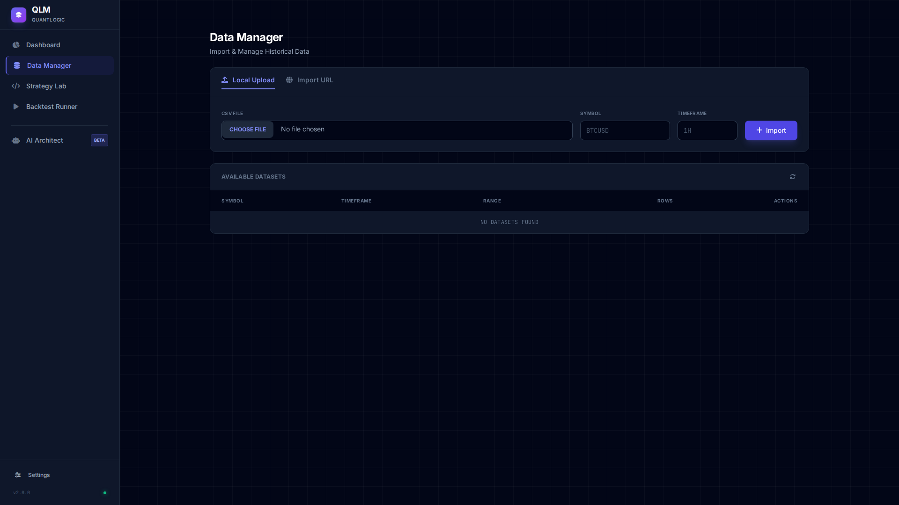

<div align="center">


### **An Institutional-Grade Algorithmic Trading Platform**

*High-Performance Backtesting • MCP-Native AI Integration • Multi-Exchange Live Trading*

---

<!-- Badges Row 1 -->


<!-- Badges Row 2 -->


---

<a href="#-overview"><kbd>📖 Overview</kbd></a>&nbsp;
<a href="#-quick-start"><kbd>🚀 Quick Start</kbd></a>&nbsp;
<a href="#-mcp-service"><kbd>🤖 MCP Tools</kbd></a>&nbsp;
<a href="#-api-reference"><kbd>🔌 API</kbd></a>&nbsp;
<a href="#-installation"><kbd>⚙️ Install</kbd></a>

<br/><br/>


</div>

---

## 📖 Table of Contents

<table>
<tr>
<td width="50%" valign="top">

### 🏗️ Architecture & Setup
- [Overview](#-overview)
- [Key Features](#-key-features)
- [Architecture](#-architecture)
- [Technology Stack](#-technology-stack)
- [Installation](#-installation)
- [Quick Start](#-quick-start)

</td>
<td width="50%" valign="top">

### 🔧 Components & Reference
- [Backtest Engine](#-backtest-engine)
- [Strategy System](#-strategy-system)
- [Data Management](#-data-management)
- [MCP Service](#-mcp-service)
- [Live Execution](#-live-execution)
- [Metrics & Analytics](#-metrics--analytics)
- [API Reference](#-api-reference)
- [Testing](#-testing)

</td>
</tr>
</table>

---

## 📖 Overview

**QLM (QuantLogic Framework)** is a production-grade algorithmic trading platform engineered for quantitative researchers, hedge funds, prop trading firms, and algorithmic traders who demand **institutional-quality tools** with **uncompromising reliability**.

### 🎯 Why QLM?

| Challenge | QLM Solution |
|-----------|--------------|
| 🔴 Slow backtesting | ⚡ **Numba JIT-accelerated** engine - orders of magnitude faster |
| 🔴 No AI integration | 🤖 **Native MCP server** - works with Claude, Cursor, Windsurf |
| 🔴 Data corruption | 💾 **ACID-compliant SQLite** with WAL mode for reliability |
| 🔴 Vendor lock-in | 🔓 **Open architecture** - CCXT supports 100+ exchanges |
| 🔴 Poor observability | 📊 **Institutional metrics** - MAE/MFE, R-Multiple, SQN |

### ✨ Platform Highlights

<table>
<tr>
<td width="25%" align="center">

<br/><br/>
<b>Numba-Accelerated</b>
<br/><small>JIT-compiled backtest loops</small>
</td>
<td width="25%" align="center">

<br/><br/>
<b>MCP-Native</b>
<br/><small>16+ tools for AI clients</small>
</td>
<td width="25%" align="center">

<br/><br/>
<b>Institutional Grade</b>
<br/><small>MAE/MFE, R-Multiple, SQN</small>
</td>
<td width="25%" align="center">

<br/><br/>
<b>Multi-Exchange</b>
<br/><small>CCXT-powered execution</small>
</td>
</tr>
</table>

---

## 🔑 Key Features

### ⚡ High-Performance Backtesting

<details open>
<summary><b>Core Capabilities</b></summary>

| Feature | Description | Benefit |
|---------|-------------|---------|
| **Numba JIT Compilation** | Compiles backtest loops to native machine code | 10-100x faster execution |
| **Dual Execution Modes** | Fast (Numba) and Legacy (Python) modes | Debugging flexibility |
| **Vectorized Signals** | Pandas-based signal generation | Efficient memory usage |
| **Gap Handling** | Realistic SL/TP execution on gaps | Accurate results |
| **Weekend Filtering** | Automatic exclusion of weekend trades | Forex market accuracy |
| **Parallel Optimization** | ThreadPoolExecutor for grid search | Multi-core utilization |

</details>

### 📊 Advanced Metrics Engine

<details>
<summary><b>Complete Metrics Suite</b></summary>

#### 📈 PnL Metrics
| Metric | Formula | Description |
|--------|---------|-------------|
| Net Profit | Σ(Trade PnL) | Total profit/loss |
| Gross Profit | Σ(Positive PnL) | Sum of winning trades |
| Gross Loss | Σ\|Negative PnL\| | Sum of losing trades |
| Profit Factor | Gross Profit / Gross Loss | Risk-reward ratio |
| ROI % | (Net Profit / Initial Capital) × 100 | Return on investment |

#### 📉 Risk Metrics
| Metric | Description |
|--------|-------------|
| **Max Drawdown** | Maximum peak-to-valley equity decline |
| **Max Drawdown %** | Drawdown as percentage of peak |
| **Max Runup** | Maximum peak above initial capital |
| **VaR (95%)** | Value at Risk at 95% confidence |
| **Sharpe Ratio** | Risk-adjusted return measure |
| **Sortino Ratio** | Downside deviation adjusted return |
| **SQN** | System Quality Number |

#### 🎯 Trade Metrics
| Metric | Description |
|--------|-------------|
| **Win Rate** | Percentage of profitable trades |
| **Expectancy** | Average expected profit per trade |
| **R-Multiple** | Profit normalized to initial risk |
| **MAE** | Maximum Adverse Excursion |
| **MFE** | Maximum Favorable Excursion |
| **Avg Duration** | Average trade holding time |

</details>

### 🤖 MCP-Native AI Integration

<details>
<summary><b>MCP Architecture</b></summary>

QLM implements the **Model Context Protocol (MCP)** as the primary interface for AI-powered trading operations:

```
┌─────────────────────────────────────────────────────────────────┐
│                    EXTERNAL AI CLIENTS                          │
│  ┌───────────┐  ┌───────────┐  ┌───────────┐  ┌───────────┐   │
│  │  Claude   │  │  Cursor   │  │  Windsurf │  │  Custom   │   │
│  │  Desktop  │  │   IDE     │  │   IDE     │  │  Clients  │   │
│  └─────┬─────┘  └─────┬─────┘  └─────┬─────┘  └─────┬─────┘   │
└────────┼──────────────┼──────────────┼──────────────┼─────────┘
         │              │              │              │
         └──────────────┴───────┬──────┴──────────────┘
                                │ SSE Transport
                    ┌───────────┴───────────┐
                    │      QLM MCP Server   │
                    │  ┌─────────────────┐  │
                    │  │   16+ MCP Tools │  │
                    │  └────────┬────────┘  │
                    └───────────┼───────────┘
                                │
         ┌──────────────────────┼──────────────────────┐
         │                      │                      │
   ┌─────┴─────┐         ┌─────┴─────┐         ┌─────┴─────┐
   │   Data    │         │ Backtest  │         │ Strategy  │
   │  Manager  │         │  Engine   │         │  Loader   │
   └───────────┘         └───────────┘         └───────────┘
```

</details>

---

## 🏗️ Architecture

<div align="center">

```
                              ┌────────────────────────────────────────┐
                              │           FRONTEND LAYER               │
                              │  ┌──────────────────────────────────┐  │
                              │  │  Vanilla JS + Tailwind CSS       │  │
                              │  │  Monaco Editor + Lightweight     │  │
                              │  │  Charts                          │  │
                              │  └──────────────────────────────────┘  │
                              └───────────────────┬────────────────────┘
                                                  │
                              ┌───────────────────┴────────────────────┐
                              │            API GATEWAY                 │
                              │  ┌────────┐ ┌────────┐ ┌────────────┐  │
                              │  │ REST   │ │  WS    │ │ MCP Server │  │
                              │  │ API    │ │ Events │ │ (SSE)      │  │
                              │  └────────┘ └────────┘ └────────────┘  │
                              └───────────────────┬────────────────────┘
                                                  │
                              ┌───────────────────┴────────────────────┐
                              │           CORE ENGINE                  │
                              │  ┌──────────┐ ┌──────────┐ ┌────────┐  │
                              │  │ Backtest │ │ Strategy │ │ Metrics│  │
                              │  │ Engine   │ │  Loader  │ │ Engine │  │
                              │  │ (Numba)  │ │          │ │        │  │
                              │  └──────────┘ └──────────┘ └────────┘  │
                              │  ┌──────────┐ ┌──────────┐ ┌────────┐  │
                              │  │  Data    │ │ Execution│ │ Live   │  │
                              │  │ Manager  │ │ Handler  │ │ Trading│  │
                              │  └──────────┘ └──────────┘ └────────┘  │
                              └───────────────────┬────────────────────┘
                                                  │
                              ┌───────────────────┴────────────────────┐
                              │         PERSISTENCE LAYER              │
                              │  ┌──────────┐ ┌──────────┐ ┌────────┐  │
                              │  │ SQLite   │ │ Parquet  │ │  Logs  │  │
                              │  │ (WAL)    │ │ (PyArrow)│ │  CSV   │  │
                              │  └──────────┘ └──────────┘ └────────┘  │
                              └────────────────────────────────────────┘
```

</div>

---

## 🛠️ Technology Stack

<table>
<tr>
<th align="center">🖥️ Backend</th>
<th align="center">🎨 Frontend</th>
<th align="center">🔧 Infrastructure</th>
</tr>
<tr>
<td>

| Component | Technology |
|-----------|------------|
| Framework | **FastAPI 0.109** |
| ASGI | **Uvicorn** |
| Compute | **NumPy**, **Pandas** |
| Acceleration | **Numba 0.59** |
| Database | **SQLite (WAL)** |
| Storage | **PyArrow/Parquet** |
| AI Protocol | **MCP 1.2** |
| Exchange | **CCXT 4.2** |
| Validation | **Pydantic 2.10** |

</td>
<td>

| Component | Technology |
|-----------|------------|
| Language | **Vanilla JavaScript** |
| Styling | **Tailwind CSS** |
| Editor | **Monaco Editor** |
| Charts | **Lightweight Charts** |
| Icons | **Font Awesome 6** |
| Fonts | **Inter**, **JetBrains Mono** |

</td>
<td>

| Component | Technology |
|-----------|------------|
| Testing | **Pytest 8.0** |
| Logging | **Structlog** |
| Retry | **Tenacity** |
| GA | **DEAP** |
| Async | **aiohttp**, **websockets** |

</td>
</tr>
</table>

---

## ⚙️ Installation

### 📋 Prerequisites


### 🚀 Quick Install

```bash
# Clone the repository
git clone https://github.com/Praveens1234/QLM.git
cd QLM

# Create virtual environment
python -m venv venv
source venv/bin/activate  # Linux/macOS
# .\venv\Scripts\activate  # Windows

# Install dependencies
pip install -r requirements.txt

# Start the server
python -m backend.main
```

### 🌐 Access Points

| Service | URL | Description |
|---------|-----|-------------|
| **Web UI** | `http://localhost:8010` | Main dashboard interface |
| **API Docs** | `http://localhost:8010/docs` | FastAPI Swagger documentation |
| **MCP Endpoint** | `http://localhost:8010/api/mcp/sse` | MCP client connection |
| **Health Check** | `http://localhost:8010/health` | Server status |

---

## 🚀 Quick Start

### 1️⃣ Import Data

Navigate to **Data Manager** → Upload CSV or import from URL:

```csv
datetime,open,high,low,close,volume
2024-01-01 00:00:00,1.1234,1.1250,1.1220,1.1245,1000
2024-01-01 01:00:00,1.1245,1.1260,1.1230,1.1255,1200
...
```

### 2️⃣ Create Strategy

Navigate to **Strategy Lab** and write:

```python
from backend.core.strategy import Strategy
import pandas as pd

class SMAStrategy(Strategy):
    """Simple SMA Crossover Strategy"""
    
    def define_variables(self, df: pd.DataFrame) -> dict:
        close = df['close']
        return {
            "sma_fast": close.rolling(10).mean(),
            "sma_slow": close.rolling(30).mean()
        }
    
    def entry_long(self, df: pd.DataFrame, vars: dict) -> pd.Series:
        return (vars['sma_fast'] > vars['sma_slow']) & \
               (vars['sma_fast'].shift(1) <= vars['sma_slow'].shift(1))
    
    def entry_short(self, df: pd.DataFrame, vars: dict) -> pd.Series:
        return (vars['sma_fast'] < vars['sma_slow']) & \
               (vars['sma_fast'].shift(1) >= vars['sma_slow'].shift(1))
    
    def risk_model(self, df: pd.DataFrame, vars: dict) -> dict:
        atr = (df['high'] - df['low']).rolling(14).mean().iloc[-1]
        return {
            "stop_loss_dist": atr * 2,
            "take_profit_dist": atr * 3
        }
    
    def exit(self, df: pd.DataFrame, vars: dict, trade: dict) -> bool:
        return False  # Let SL/TP handle exits
```

### 3️⃣ Run Backtest

Navigate to **Backtest Runner** → Select dataset & strategy → **Run Simulation**

### 4️⃣ Connect AI via MCP

Configure your AI client (Claude Desktop, Cursor, etc.):

```json
{
  "mcpServers": {
    "qlm": {
      "url": "http://localhost:8010/api/mcp/sse"
    }
  }
}
```

Ask your AI:
> "List all datasets and run a backtest on XAUUSD 1H using SMAStrategy"

---

## 🤖 MCP Service

### 🔌 Endpoints

| Endpoint | Method | Description |
|----------|--------|-------------|
| `/api/mcp/sse` | `GET` | SSE connection for MCP clients |
| `/api/mcp/messages` | `POST` | JSON-RPC message handling |
| `/api/mcp/status` | `GET` | Server status and activity logs |
| `/api/mcp/toggle` | `POST` | Enable/disable MCP service |

### 🧰 Available Tools (16)

<details>
<summary><b>📁 Data Management Tools</b></summary>

| Tool | Description | Parameters |
|------|-------------|------------|
| `list_datasets` | List all available datasets | None |
| `import_dataset_from_url` | Import data from URL | `url`, `symbol`, `timeframe` |
| `get_market_data` | Fetch sample market data | `symbol`, `timeframe` |
| `inspect_dataset_row` | Search data by index/datetime | `symbol`, `timeframe`, `query` |

</details>

<details>
<summary><b>📈 Strategy Tools</b></summary>

| Tool | Description | Parameters |
|------|-------------|------------|
| `list_strategies` | List all trading strategies | None |
| `get_strategy_code` | Get strategy Python code | `name` |
| `create_strategy` | Create/update a strategy | `name`, `code` |
| `validate_strategy` | Validate strategy code | `code` |
| `get_strategy_coding_guidelines` | Get strategy writing rules | None |

</details>

<details>
<summary><b>⚙️ Execution Tools</b></summary>

| Tool | Description | Parameters |
|------|-------------|------------|
| `run_backtest` | Execute a backtest | `strategy_name`, `symbol`, `timeframe` |
| `get_backtest_ledger_url` | Get trade ledger download URL | `run_id` |

</details>

<details>
<summary><b>🔧 System Tools</b></summary>

| Tool | Description | Parameters |
|------|-------------|------------|
| `read_file` | Read file content | `path` |
| `write_file` | Write file content | `path`, `content` |
| `delete_entity` | Delete strategy/dataset | `type`, `id` |
| `get_system_status` | Get server health | None |
| `get_tools_manifest` | Get all tools documentation | None |

</details>

### 💡 Example AI Interaction

```
👤 User: "Analyze XAUUSD 1H and create a trend-following strategy"

🤖 AI: [Calls list_datasets] → Found: XAUUSD (1H)
     [Calls get_market_data] → Analyzing price action...
     [Calls create_strategy] → Created TrendStrategy v1
     [Calls run_backtest] → Results:
     
     📊 Performance Summary:
     ├── Net Profit: $2,450
     ├── Win Rate: 58%
     ├── Max Drawdown: 12%
     ├── Sharpe Ratio: 1.45
     └── Total Trades: 145
```

---

## 📦 Project Structure

```
QLM/
├── 📁 backend/
│   ├── main.py                    # 🚀 FastAPI entry point
│   ├── database.py                # 💾 SQLite manager
│   ├── 📁 api/                    # 🌐 API Layer
│   │   ├── mcp.py                 # 🤖 MCP server
│   │   ├── mcp_tools.py           # 🧰 MCP tools (16)
│   │   ├── mcp_session.py         # 👥 Session management
│   │   ├── transport.py           # 📡 SSE transport
│   │   ├── data.py                # 📊 Data endpoints
│   │   ├── strategy.py            # 📈 Strategy endpoints
│   │   ├── engine.py              # ⚙️ Backtest endpoints
│   │   ├── live.py                # 💹 Live trading
│   │   └── ws.py                  # 🔌 WebSocket
│   └── 📁 core/                   # ⚡ Core Engine
│       ├── engine.py              # 🏎️ Main backtest engine
│       ├── fast_engine.py         # 🚄 Numba-accelerated
│       ├── strategy.py            # 📋 Strategy base class
│       ├── metrics.py             # 📊 Performance metrics
│       ├── data.py                # 📁 Data management
│       └── execution_live.py      # 💳 CCXT execution
│
├── 📁 frontend/
│   ├── index.html                 # 🎨 Main UI
│   ├── 📁 css/                    # 🎭 Styling
│   └── 📁 js/                     # ⚙️ JavaScript
│       ├── app.js                 # 🚀 Bootstrap
│       ├── 📁 core/               # 🔧 Core modules
│       ├── 📁 services/           # 🌐 API services
│       └── 📁 views/              # 📱 UI views
│
├── 📁 strategies/                 # 📈 Strategy storage
├── 📁 tests/                      # 🧪 Test suite (30+)
├── 📁 data/                       # 💾 Parquet datasets
├── 📁 logs/                       # 📝 Trade logs
└── 📁 public/                     # 🖼️ Screenshots
```

---

## 📈 Backtest Engine

### ⚡ Performance Comparison

| Engine | Speed | Use Case |
|--------|-------|----------|
| **Fast (Numba)** | 10-100x faster | Production backtests, optimization |
| **Legacy (Python)** | Baseline | Debugging, complex strategies |

### 📝 Trade Record Schema

```python
{
    "entry_time": "2024-01-15 10:30:00",
    "exit_time": "2024-01-15 14:45:00",
    "entry_price": 1.12345,
    "exit_price": 1.12567,
    "direction": "long",              # or "short"
    "pnl": 222.00,                    # Net profit
    "gross_pnl": 225.00,
    "commission": 3.00,
    "r_multiple": 1.5,                # Risk-normalized
    "sl": 1.12100,                    # Stop loss
    "tp": 1.12600,                    # Take profit
    "mae": 15.0,                      # Max Adverse Excursion
    "mfe": 45.0,                      # Max Favorable Excursion
    "duration": 255.0,                # Minutes
    "exit_reason": "TP Hit",          # SL Hit, Signal, End of Data
    "size": 1.0,
    "initial_risk": 148.00
}
```

---

## 📋 Strategy System

### 🔧 Required Methods

```python
class Strategy(ABC):
    @abstractmethod
    def define_variables(self, df: pd.DataFrame) -> Dict[str, pd.Series]: pass
    
    @abstractmethod
    def entry_long(self, df: pd.DataFrame, vars: Dict) -> pd.Series: pass
    
    @abstractmethod
    def entry_short(self, df: pd.DataFrame, vars: Dict) -> pd.Series: pass
    
    @abstractmethod
    def risk_model(self, df: pd.DataFrame, vars: Dict) -> Dict: pass
    
    @abstractmethod
    def exit(self, df: pd.DataFrame, vars: Dict, trade: Dict) -> bool: pass
```

### 🛡️ Security Validation

| Check | Description |
|-------|-------------|
| **AST Parsing** | Validates syntax structure |
| **Import Filtering** | Only safe modules allowed |
| **Function Blocking** | `exec`, `eval`, `open` blocked |
| **Path Traversal** | Prevented with validation |
| **Runtime Simulation** | Tests with NaN, zeros |

<details>
<summary><b>✅ Allowed Modules</b></summary>

```python
SAFE_MODULES = {
    'math', 'numpy', 'pandas', 'typing', 'datetime',
    'collections', 'itertools', 'functools', 'random',
    'statistics', 'scipy', 'sklearn', 'talib', 'backend'
}
```

</details>

---

## 📊 Metrics & Analytics

### 📐 Mathematical Formulas

<details>
<summary><b>Profit Factor</b></summary>

$$\text{Profit Factor} = \frac{\text{Gross Profit}}{\text{Gross Loss}}$$

- **> 1.5**: Good strategy
- **> 2.0**: Excellent strategy
- **> 3.0**: Outstanding (rare)

</details>

<details>
<summary><b>Maximum Drawdown</b></summary>

$$\text{Drawdown}_t = \text{Equity}_t - \max(\text{Equity}_{0..t})$$

$$\text{Max DD} = \min(\text{Drawdown}_t)$$

</details>

<details>
<summary><b>Sharpe Ratio</b></summary>

$$\text{Sharpe} = \frac{\mu_{returns}}{\sigma_{returns}}$$

- **< 1**: Sub-optimal
- **1-2**: Good
- **> 2**: Excellent

</details>

<details>
<summary><b>Sortino Ratio</b></summary>

$$\text{Sortino} = \frac{\mu_{returns} - \text{Target}}{\sigma_{downside}}$$

Where:
$$\sigma_{downside} = \sqrt{\frac{1}{N} \sum (\min(0, \text{Return} - \text{Target}))^2}$$

</details>

<details>
<summary><b>System Quality Number (SQN)</b></summary>

$$\text{SQN} = \sqrt{N} \times \frac{\mu_{pnl}}{\sigma_{pnl}}$$

| SQN | Rating |
|-----|--------|
| < 1.6 | Poor |
| 1.6 - 2.0 | Average |
| 2.0 - 2.5 | Good |
| 2.5 - 3.0 | Excellent |
| > 3.0 | Outstanding |

</details>

---

## 🌐 API Reference

### 📍 Base URL

```
http://localhost:8010/api
```

### 📚 Endpoints

<details>
<summary><b>📁 Data Management</b></summary>

```
GET    /data/              # List all datasets
POST   /data/upload        # Upload CSV file
POST   /data/url           # Import from URL
GET    /data/{id}          # Get dataset metadata
DELETE /data/{id}          # Delete dataset
POST   /data/{id}/scan     # Scan for discrepancies
POST   /data/{id}/fix      # Auto-fix issues
```

</details>

<details>
<summary><b>📈 Strategies</b></summary>

```
GET    /strategies/        # List all strategies
GET    /strategies/{name}  # Get strategy code
POST   /strategies/        # Create strategy
DELETE /strategies/{name}  # Delete strategy
POST   /strategies/validate # Validate code
```

</details>

<details>
<summary><b>⚙️ Backtest</b></summary>

```
POST   /backtest/run       # Execute backtest
```

**Request Body:**
```json
{
    "dataset_id": "uuid-string",
    "strategy_name": "MyStrategy",
    "use_fast": true,
    "initial_capital": 10000,
    "leverage": 1.0
}
```

</details>

<details>
<summary><b>🤖 MCP Service</b></summary>

```
GET    /mcp/status         # Get MCP server status
POST   /mcp/toggle         # Enable/disable MCP
GET    /mcp/sse            # SSE endpoint (MCP clients)
POST   /mcp/messages       # Message endpoint (MCP clients)
```

</details>

<details>
<summary><b>💳 Live Trading</b></summary>

```
GET    /live/status        # Get execution status
POST   /live/start         # Start live trading
POST   /live/stop          # Stop live trading
```

</details>

### 🔌 WebSocket Events

```
ws://localhost:8010/api/ws
```

| Event | Description |
|-------|-------------|
| `backtest_progress` | Progress updates |
| `backtest_complete` | Final results |
| `backtest_error` | Error notification |
| `resource_update` | Strategy/dataset changes |

---

## 🧪 Testing

### 📁 Test Categories

| Category | Files | Coverage |
|----------|-------|----------|
| Core Engine | `test_quant_core.py`, `test_engine_parity.py` | Backtest logic |
| Metrics | `test_metrics_*.py` | All calculations |
| API | `test_api_errors.py`, `test_e2e_api_flow.py` | REST endpoints |
| MCP | `test_mcp_fuzz.py` | MCP protocol |
| Live | `test_live_execution.py` | CCXT integration |
| Stress | `stress_test.py` | Performance limits |

### 🏃 Running Tests

```bash
# Run all tests
pytest tests/

# Run specific category
pytest tests/test_metrics_*.py -v

# With coverage report
pytest tests/ --cov=backend --cov-report=html

# Parallel execution
pytest tests/ -n auto
```

---

## 🖼️ Screenshots

<div align="center">

| Dashboard | Data Manager |
|:---------:|:------------:|
|  |  |
| *System overview & stats* | *Import & manage data* |

| Strategy Lab | Backtest Runner |
|:------------:|:---------------:|
|  |  |
| *Monaco-powered editor* | *Execute simulations* |

| MCP Dashboard | Mobile View |
|:-------------:|:-----------:|
|  |  |
| *MCP service control* | *Responsive design* |

</div>

---

## 🤝 Contributing

We welcome contributions! Please follow these guidelines:

### 📋 Workflow

1. **Fork** the repository
2. **Create** a feature branch (`git checkout -b feature/amazing-feature`)
3. **Commit** your changes (`git commit -m 'Add amazing feature'`)
4. **Push** to the branch (`git push origin feature/amazing-feature`)
5. **Open** a Pull Request

### 📝 Code Style

- Follow **PEP 8** for Python code
- Use **type hints** for function parameters
- Write **docstrings** for public methods
- Add **tests** for new functionality

---

## 📄 License

This project is licensed under the **MIT License** - see the [LICENSE](LICENSE) file for details.

---

## 🙏 Acknowledgments

<table>
<tr>
<td align="center">
<a href="https://fastapi.tiangolo.com/">

</a>
</td>
<td align="center">
<a href="https://numba.pydata.org/">

</a>
</td>
<td align="center">
<a href="https://modelcontextprotocol.io/">

</a>
</td>
<td align="center">
<a href="https://github.com/ccxt/ccxt">

</a>
</td>
</tr>
</table>

---

<div align="center">

### ⭐ Star this repository if you find it useful!


<br/><br/>

**Built with ❤️ for Quantitative Traders**

*© 2024 QLM - QuantLogic Framework*

</div>
